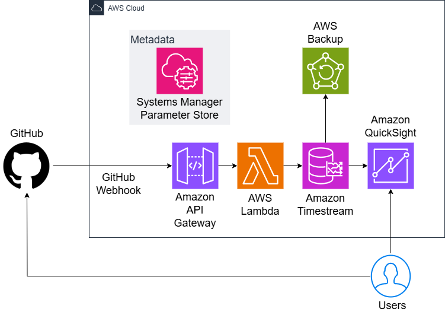

> [!CAUTION]
> github-activity-metrics-aws-2 is a new version of [github-activity-metrics-aws](https://github.com/yutaro-sakamoto/github-activity-metrics-aws).


**Under construction**

This project constructs the instructure which collects GitHub Webhook data, stores it and visualizes it.



# Setup the infrastructure

## Register a secret token

First, you generate a secret token for GitHub Webhook.
This token should be a long random string.

Then, you register the token in AWS Systems Manager Parameter store.
[AWS official document](https://docs.aws.amazon.com/ja_jp/systems-manager/latest/userguide/sysman-paramstore-su-create.html) describes how to register a parameter.

The necessary settings of this secert is below.

- Name: `/github/metrics/secret-token`
- Type: `SecureString`
- Data type: `text`
- Value: The secret token you generated in the first step.

You can set other options freely.

## Clone the repository

```bash
git clone https://github.com/yutaro-sakamoto/github-activity-metrics-aws
```

## Deploy the infrastructure

```bash
yarn deploy
```

Memorize the value of `github-activity-metrics-aws-dev.WebhookApiUrl` in the output of the command above.

## Setup the GitHub Webhook

### Open the GitHub Webhook settings page

If you would like to create a Webhook for a specific repository, see [this page](https://docs.github.com/en/webhooks/using-webhooks/creating-webhooks#creating-a-repository-webhook).
If you would like to create a Webhook for a specific organization, see [this page](https://docs.github.com/en/webhooks/using-webhooks/creating-webhooks#creating-an-organization-webhook).

Then fisnish "Click Add webhook" step.

### Create a GitHub Webhook

Input the folowing values in the GitHub Webhook settings page.

- **Payload URL**: The value of `github-activity-metrics-aws-dev.WebhookApiUrl` in the output of `yarn deploy`.
- **Content type**: `application/json`
- **Secret**: The secret token you registered in the AWS Systems Manager Parameter store.
- **SSL verification**: `Enable SSL verification`
- **Which events would you like to trigger this webhook?**: Although `Send me everything.` is recommended, you can select other options.
- **Active**: Enable this option.

Then click `Add webhook` button.
If you successfully deployed all the infrastructure, you will see a green check mark in the `Recent Deliveries` section of the GitHub Webhook settings page.

# Examples

**This sections is under construction.**

Run the following command to send a sample event using Custom Data API.

```
curl -X POST \
--header "x-api-key:<<<<API Key>>>>" \
--header "Content-Type: application/json" \
--data '{
  "Dimensions": [
    {"Name": "repository", "Value": "@example-repo"},
    {"Name": "action", "Value": "push"}
  ],
  "MeasureName": "event_count",
  "MeasureValueType": "BIGINT",
  "MeasureValue": "2"
}' \
<<<<URL of Custom Data API>>>>
```
